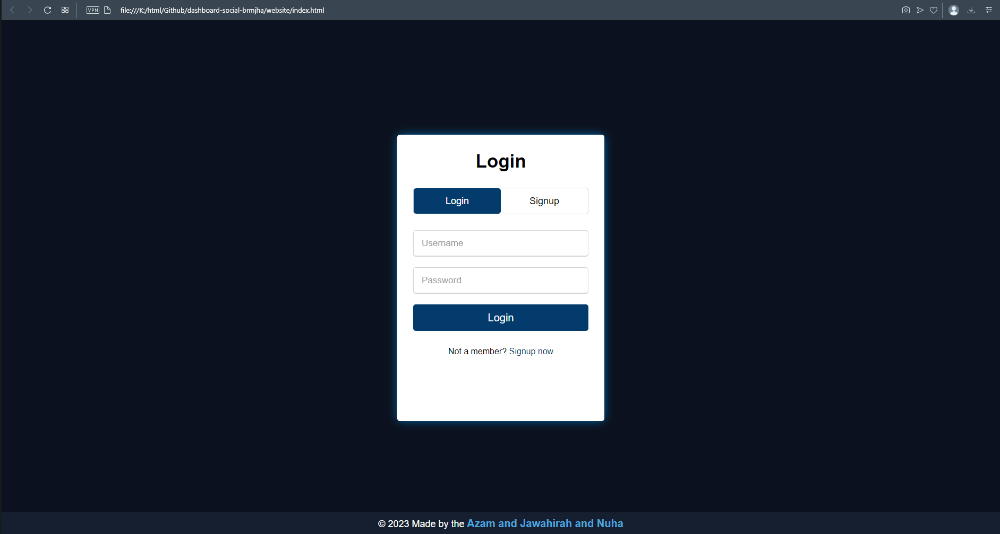
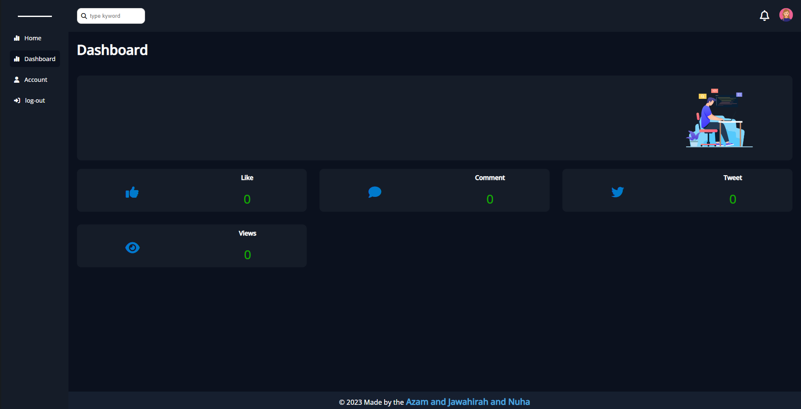

# dashboard

 ## A website showing the interaction of the user account in the Twitter program.The project contains:

*   login and signup page
*    The home page contains a dashboard, account and logout page
*    The dashboard page contains: Tweet stats, comments, likes and views in his Twitter account
*    The account page contains user information and the log-out page

# the sign page:
 https://azampro.github.io/dashboard-social-brmjha/website

# the dashboard page:
https://azampro.github.io/dashboard-social-brmjha/website/dashboard
## Features

- dark mode 
- Live previews
- Fullscreen mode
- Cross platform

## Made it By

This project is made by the following programmer:

- Azam alkhodiriy
- Nuha Alsufyani
- Jawahirah Alsafari

# preview the project

<video src="website/imge/Login.mp4"></video>
<video src="website/imge/how-to-run-the-server.mp4"></video>